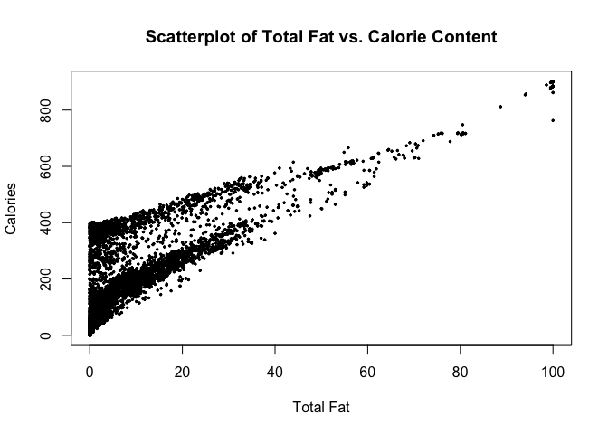

USDA Nutrients Analysis
================
Rozita Abdoli

#### Read the files.

``` r
macro <- read.csv(file="USDAmacro.csv", header=T, sep=",")
micro <- read.csv(file="USDAmicro.csv", header=T, sep=",")
```

#### Merge using the variable “ID”.

``` r
USDA <- merge(macro, micro, by="ID")
head(USDA)
```

    ##     ID              Description Calories Protein TotalFat Carbohydrate Sodium
    ## 1 1001         BUTTER,WITH SALT      717    0.85    81.11         0.06    714
    ## 2 1002 BUTTER,WHIPPED,WITH SALT      717    0.85    81.11         0.06    827
    ## 3 1003     BUTTER OIL,ANHYDROUS      876    0.28    99.48         0.00      2
    ## 4 1004              CHEESE,BLUE      353   21.40    28.74         2.34  1,395
    ## 5 1005             CHEESE,BRICK      371   23.24    29.68         2.79    560
    ## 6 1006              CHEESE,BRIE      334   20.75    27.68         0.45    629
    ##   Cholesterol Sugar Calcium Iron Potassium VitaminC VitaminE VitaminD
    ## 1         215  0.06      24 0.02        24        0     2.32      1.5
    ## 2         219  0.06      24 0.16        26        0     2.32      1.5
    ## 3         256  0.00       4 0.00         5        0     2.80      1.8
    ## 4          75  0.50     528 0.31       256        0     0.25      0.5
    ## 5          94  0.51     674 0.43       136        0     0.26      0.5
    ## 6         100  0.45     184 0.50       152        0     0.24      0.5

``` r
#Check data types of attributes before making changes. Can see in the result that the datatype of Sodium and Potassium is "factor".
sapply(USDA, class)
```

    ##           ID  Description     Calories      Protein     TotalFat Carbohydrate 
    ##    "integer"  "character"    "integer"    "numeric"    "numeric"    "numeric" 
    ##       Sodium  Cholesterol        Sugar      Calcium         Iron    Potassium 
    ##  "character"    "integer"    "numeric"    "integer"    "numeric"  "character" 
    ##     VitaminC     VitaminE     VitaminD 
    ##    "numeric"    "numeric"    "numeric"

``` r
#remove commas from Sodium and Potassium and make their data type numeric
USDA$Sodium <- as.numeric(gsub(",","",USDA$Sodium))
USDA$Potassium <- as.numeric(gsub(",","",USDA$Potassium))
#check data types of Sodium and Potassium again
class(USDA$Sodium)
```

    ## [1] "numeric"

``` r
class(USDA$Potassium)
```

    ## [1] "numeric"

#### Remove records with missing values in more than 4 attributes.

``` r
USDA <- USDA[rowSums(is.na(USDA)) <= 4,]
remaining <- nrow(USDA)
sprintf("%s remaining records in the data frame.", remaining)
```

    ## [1] "6887 remaining records in the data frame."

#### For records with missing values for Sugar, Vitamin E and Vitamin D, replace missing values with mean value for the respective variable.

``` r
USDA$Sugar[which(is.na(USDA$Sugar))] <- round(mean(USDA$Sugar,na.rm = TRUE), digits=2)
USDA$VitaminE[which(is.na(USDA$VitaminE))] <- round(mean(USDA$VitaminE,na.rm = TRUE), digits=2)
USDA$VitaminD[which(is.na(USDA$VitaminD))] <- round(mean(USDA$VitaminD,na.rm = TRUE), digits=1)
#checked to make sure there are no NAs in these 3 columns now:
sum(is.na(USDA$Sugar))
```

    ## [1] 0

``` r
sum(is.na(USDA$VitaminE))
```

    ## [1] 0

``` r
sum(is.na(USDA$VitaminD))
```

    ## [1] 0

#### Remove remaining records with missing values.

``` r
USDAclean <- na.omit(USDA)
remaining2 <- nrow(USDAclean)
sprintf("%s remaining records in the data frame.", remaining2)
```

    ## [1] "6310 remaining records in the data frame."

``` r
#checked to make sure there are no NAs in any columns now:
sapply(USDAclean, function(x) sum(is.na(x)))
```

    ##           ID  Description     Calories      Protein     TotalFat Carbohydrate 
    ##            0            0            0            0            0            0 
    ##       Sodium  Cholesterol        Sugar      Calcium         Iron    Potassium 
    ##            0            0            0            0            0            0 
    ##     VitaminC     VitaminE     VitaminD 
    ##            0            0            0

#### Check which food has the highest sodium level.

``` r
maxNa <- USDAclean$Description[which.max(USDAclean$Sodium)]
sprintf("%s has the highest sodium!", maxNa)
```

    ## [1] "SALT,TABLE has the highest sodium!"

#### Histogram of Vitamin C distribution. Since the VitaminC data is very skewed (a lot of zeros and near zeros, but the maximum value is 2400), limited the x axis to the values between 0 and 100 to be able to show the data distribution better.

``` r
hist(USDAclean$VitaminC, main = "Histogram of Vitamin C Distribution in Foods", xlab = "Vitamin C",breaks=100, xlim = c(0,100), col="orange")
```

<!-- -->

#### The distribution of TotalFat, Protein and Carbohydrate.

``` r
macroClean <- data.frame(USDAclean$TotalFat, USDAclean$Protein, USDAclean$Carbohydrate)
boxplot(macroClean, names= c("Total Fat", "Protein", "Carbohydrate"),  main="Boxplots to Show the Distributions", ylab="Values")
```

<!-- -->

#### The relationship between a food’s TotalFat content and its Calorie content.

``` r
plot(USDAclean$TotalFat, USDAclean$Calories, xlab="Total Fat", ylab="Calories", main="Scatterplot of Total Fat vs. Calorie Content", pch=20, cex=0.5)
```

<!-- -->

#### Create new variables where value=1 if the food has higher than average Sodium/Calories/Protein/Sugar/Fat, 0 otherwise.

``` r
USDAclean$HighSodium <- ifelse(USDAclean$Sodium>mean(USDAclean$Sodium), 1, 0)
USDAclean$HighCalories <- ifelse(USDAclean$Calories>mean(USDAclean$Calories), 1, 0)
USDAclean$HighProtein <- ifelse(USDAclean$Protein>mean(USDAclean$Protein), 1, 0)
USDAclean$HighSugar <- ifelse(USDAclean$Sugar>mean(USDAclean$Sugar), 1, 0)
USDAclean$HighFat <- ifelse(USDAclean$TotalFat>mean(USDAclean$TotalFat), 1, 0)
#How many foods have both high sodium and high fat? 
highNaFat <- nrow(USDAclean[USDAclean$HighSodium == 1 & USDAclean$HighFat ==1,])
sprintf("%s Foods with both high sodium and high fat.", highNaFat)
```

    ## [1] "644 Foods with both high sodium and high fat."

#### Calculate the average amount of iron for high and low protein foods.

``` r
avg_iron_high_p <- round(mean(USDAclean$Iron[USDAclean$HighProtein == 1]), digits = 2)
avg_iron_low_p <- round(mean(USDAclean$Iron[USDAclean$HighProtein == 0]), digits = 2)

sprintf("Average amount of iron for high protein foods: %s", avg_iron_high_p)
```

    ## [1] "Average amount of iron for high protein foods: 3.07"

``` r
sprintf("Average amount of iron for low protein foods: %s", avg_iron_low_p)
```

    ## [1] "Average amount of iron for low protein foods: 2.7"

#### Create a function for a “HealthCheck” program to detect unhealthy foods.

``` r
#HCheck function input is the food ID
HCheck <- function(x) {
if(USDAclean$HighSodium[USDAclean$ID == x] == 1) {        
      if(USDAclean$HighSugar[USDAclean$ID == x] == 1) {  
         if(USDAclean$HighFat[USDAclean$ID == x] == 1) { return("Fail")}
         else { return("Pass") } }
      else { return("Pass") } }
   else { return("Pass")} }

#test the function using food ID = 11373.
HCheck(11373)
```

    ## [1] "Pass"

#### Add a new variable called HealthCheck using the output of the function.

``` r
USDAclean$HealthCheck <- sapply(USDAclean$ID, HCheck)
```

#### How many foods fail the HealthCheck?

``` r
sum(USDAclean$HealthCheck == "Fail")
```

    ## [1] 237

#### Visualize the correlation between Calories, Protein, Total Fat, Carbohydrate, Sodium, and Cholesterol.

``` r
df <- USDAclean[, c("Calories", "Protein", "TotalFat", "Carbohydrate", "Sodium", "Cholesterol" )]
dfc <- cor(df)
# install.packages('corrplot')
library('corrplot') 
```

    ## corrplot 0.90 loaded

``` r
corrplot(dfc, method = "circle") 
```

<!-- -->

#### The correlation between Calories and Total Fat is statistically significant. p\_value is not only less than 0.05 (default alpha), but also it’s a very small p-value (2.2e-16). Can reject the null hypothesis (Ho : correlation is equal to zero).

``` r
cor.test(USDAclean$Calories,USDAclean$TotalFat)
```

    ## 
    ##  Pearson's product-moment correlation
    ## 
    ## data:  USDAclean$Calories and USDAclean$TotalFat
    ## t = 107.58, df = 6308, p-value < 2.2e-16
    ## alternative hypothesis: true correlation is not equal to 0
    ## 95 percent confidence interval:
    ##  0.7956139 0.8130305
    ## sample estimates:
    ##      cor 
    ## 0.804495

#### Linear Regression Model: Calories as the dependent variable. Protein, Total Fat, Carbohydrate, Sodium and Cholesterol as the independent variables.

``` r
lr <- lm(Calories ~ Protein + TotalFat + Carbohydrate + Sodium + Cholesterol, data = USDAclean)
lr
```

    ## 
    ## Call:
    ## lm(formula = Calories ~ Protein + TotalFat + Carbohydrate + Sodium + 
    ##     Cholesterol, data = USDAclean)
    ## 
    ## Coefficients:
    ##  (Intercept)       Protein      TotalFat  Carbohydrate        Sodium  
    ##    3.9882753     3.9891994     8.7716980     3.7432001     0.0003383  
    ##  Cholesterol  
    ##    0.0110138

#### Using ANOVA on the linear regression model above, can see that Sodium is the least significant independent variable. It has the largest P value (P=0.1378&gt;0.05); therefore not statistically significant.

``` r
anova(lr)
```

    ## Analysis of Variance Table
    ## 
    ## Response: Calories
    ##                Df    Sum Sq   Mean Sq    F value    Pr(>F)    
    ## Protein         1   2728899   2728899 7.6197e+03 < 2.2e-16 ***
    ## TotalFat        1 116762840 116762840 3.2603e+05 < 2.2e-16 ***
    ## Carbohydrate    1  61215495  61215495 1.7093e+05 < 2.2e-16 ***
    ## Sodium          1       789       789 2.2031e+00    0.1378    
    ## Cholesterol     1     11014     11014 3.0753e+01  3.05e-08 ***
    ## Residuals    6304   2257685       358                         
    ## ---
    ## Signif. codes:  0 '***' 0.001 '**' 0.01 '*' 0.05 '.' 0.1 ' ' 1

#### New Product: Protein=0.1, TotalFat=37, Carbohydrate=400, Sodium=440, Cholesterol=75, Sugar=NA, Calcium=35, Iron=NA, Potassium=35, VitaminC=10, VitaminE=NA, VitaminD=NA.

#### Based on the model, what is the predicted value for Calories?

``` r
predicted_calorie <-predict(lr, newdata = data.frame(Protein=0.1, TotalFat=37,Carbohydrate=400, Sodium=440, Cholesterol=75))
sprintf("%s is the predicted calories.", round(predicted_calorie, digits=3))
```

    ## [1] "1827.195 is the predicted calories."

#### If the Sodium amount increases from 440 to 44440 (10000% increase), Calories only increases by 100.8%. In other words, the ratio of new over old Calories is 1.008 which is very close to the ratio of 1 showing that Calories didn’t change much.

#### This is expected since the Sodium independent variable is the least significant, as previously shown. Sodium has very little effect on the value of the dependent variable Calories (also the multiple linear regression model’s coefficient for Sodium shown above is very small: 0.0003383).

``` r
predicted_calorie_2 <-predict(lr, newdata = data.frame(Protein=0.1, TotalFat=37,Carbohydrate=400, Sodium=44440, Cholesterol=75))
calorie_change <- (predicted_calorie_2/predicted_calorie)*100
sprintf("Percentage change in calories: %s", round(calorie_change, digits=3) )
```

    ## [1] "Percentage change in calories: 100.815"
